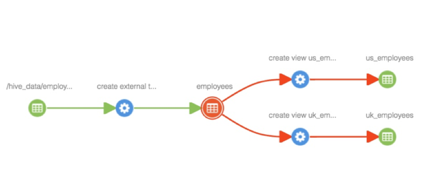
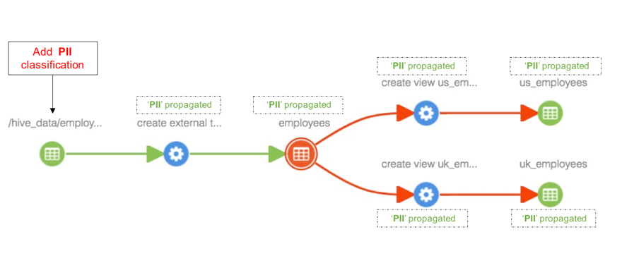
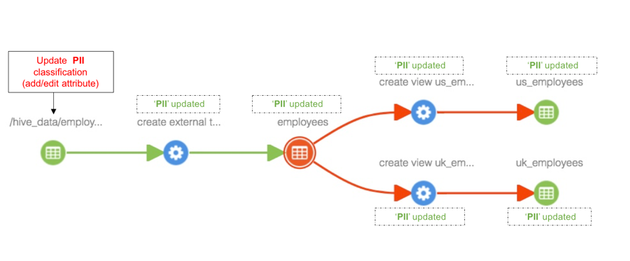
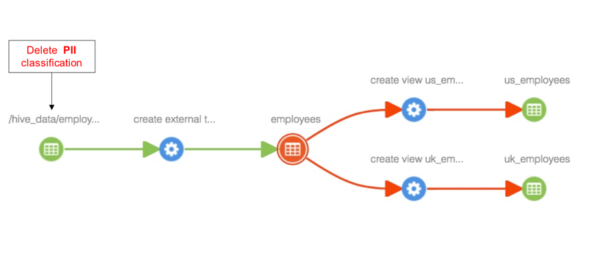

# [Classification](http://atlas.apache.org/#/ClassificationPropagation)

## Classification Propagation

- Classification 传播, 允许 classification 关联的entity 被自动的管理到其他依赖的 entity.
    - 在处理依赖(派生) dataset 场景时非常有用
- 例如, 当一个 table1 分类为 PII, table2 or view2 派生子 table1, table2和view2将自动被分类为 PII.

## 以下场景帮助理解 Classification

- 

### 向entity添加classification

- 

### 更新一个entity关联的classification

- 

### 多个entities添加血缘

- 

## 控制 Propagation